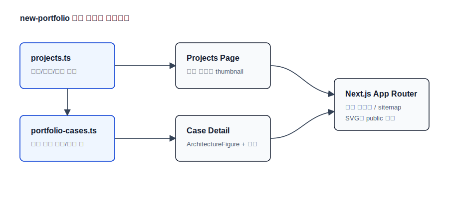

# 성진혁 Java/Spring 백엔드 포트폴리오

고동시성 예약, 이벤트 정합성, 실시간 메시징, 멀티테넌트 과금 흐름을
문제-설계-검증 근거로 읽히게 만든 한국 백엔드 개발자 포트폴리오입니다.

- Live: [new-portfolio-smoky-one-41.vercel.app](https://new-portfolio-smoky-one-41.vercel.app)
- Resume PDF: [resume-sung-jinhyuk-backend.pdf](public/resume-sung-jinhyuk-backend.pdf)
- GitHub: [github.com/sjh9714](https://github.com/sjh9714)
- Email: [jinhyuk9714@gmail.com](mailto:jinhyuk9714@gmail.com)
- Redis 글: [Redis를 캐시로만 쓰지 않기 위해 구현한 대기열, 분산 락, Presence, 정합성 복구][redis-blog]

## 30초 요약

- 이 사이트가 증명하는 것:
  Java/Spring 백엔드의 동시성, 이벤트 정합성, 실시간 메시징, 과금/정산 문제 해결입니다.
- 가장 강한 근거:
  동일 좌석 100 concurrent requests에서 success 1, fail 99, overselling 0을 기록했습니다.
- 아직 주장하지 않는 것:
  공개 운영 트래픽, production benchmark, compliance 수준의 보증은 주장하지 않습니다.

## 대표 사례

### [Concert Booking](https://new-portfolio-smoky-one-41.vercel.app/case-studies/concert-booking)

- 문제: 동일 좌석 경합, 대기열 우회, 결제/만료 race, Kafka publish 실패
- 설계: 좌석 락 전략, Queue token, Idempotency-Key, Outbox/DLT, Redis reconciliation
- 근거: 동일 좌석 100 concurrent requests -> success 1, fail 99, overselling 0
- 검증: 예약/결제/만료 정합성 Testcontainers 시나리오 검증

### [Realtime Chat](https://new-portfolio-smoky-one-41.vercel.app/case-studies/realtime-chat)

- 문제: WebSocket 구독 권한, 순서, presence, reconnect 복구
- 설계: STOMP 구독 인가, roomId key ordering, Redis presence, reconnect sync
- 근거: 채팅방 조회 API 937 -> 1,598 RPS, p95 212.85ms -> 149.22ms
- 경계: production/mixed delivery benchmark는 추가 측정 예정

### [AI Usage Billing Gateway](https://new-portfolio-smoky-one-41.vercel.app/case-studies/ai-usage-billing-gateway)

- 문제: organization 단위 사용량 수집, API key 보안, usage/webhook 중복 처리
- 설계: tenant isolation, prefix/hash API key, idempotency, quota reservation, ledger
- 근거: usage duplicate/conflict, webhook duplicate/conflict, ledger invariant 시나리오 검증
- 측정: 2026-05-23 local full mixed repeat3

## 기술 스택

- Next.js App Router
- TypeScript
- Tailwind CSS
- MDX case-study content
- shadcn/ui primitives
- lucide-react
- Vitest content guard tests

## 전체 아키텍처



SVG 구조도는 `public/architecture/overall`과 `public/architecture/cases`에 둡니다.
전체 구조도는 프로젝트 목록에서 맥락을 보여주고, 문제 구간 구조도는 각 사례 상세에서
문제-설계-검증 근거를 읽는 순서를 보조합니다. PNG/JPG/WebP 스크린샷이나 근거 없는 운영
claim은 추가하지 않습니다.

문제 구간 구조도는 raw SVG를 직접 수정하지 않고
`src/architecture/specs/*.ts`의 nodes/edges 데이터에서 생성합니다.

```bash
npm run generate:architecture
npm run check:architecture
```

전체 아키텍처 SVG(`public/architecture/overall/*.svg`)는 프로젝트 전체 맥락을 보여주는
수동 문서 자산으로 유지하고, 문제 구간 SVG(`public/architecture/cases/*.svg`)는
generator output으로 관리합니다. 작성 규칙은
[`docs/ARCHITECTURE_SVG_RULES.md`](docs/ARCHITECTURE_SVG_RULES.md)에 정리했습니다.

이 다이어그램은 구현된 핵심 흐름과 검증 대상 경계를 설명하기 위한 단순화된 구조도이며,
운영 배포 토폴로지나 production SLO를 주장하지 않습니다.

## GitHub 메타데이터

- 실제 GitHub About topics:
  `backend`, `portfolio`, `java`, `spring-boot`, `kafka`, `redis`, `rabbitmq`,
  `postgresql`, `testcontainers`, `k6`, `event-driven`, `idempotency`,
  `outbox-pattern`, `websocket`, `nextjs`

## 검증 명령

```bash
npm run ci
```

`npm run ci`는 아래 순서로 실행됩니다.

```bash
npm run format:check
npm run typecheck
npm test
npm run lint
npm run build
```

## 콘텐츠 원칙

프로젝트 근거는 `src/content/projects.ts`와 `src/content/case-studies/*.mdx`에 커밋된 내용만 사용합니다.

- 수치가 있는 결과만 `측정 완료`로 표시합니다.
- 반복 가능한 통합 테스트나 시나리오는 `시나리오 검증`으로 표시합니다.
- 공개 운영 데이터나 추가 측정이 필요한 항목은 `추가 측정 예정`으로 표시합니다.
- 운영 트래픽, production benchmark, compliance 같은 근거 없는 주장은 하지 않습니다.
- README와 사이트 문구는 문제-설계-결과-근거 순서로 작성합니다.

[redis-blog]: https://new-portfolio-smoky-one-41.vercel.app/blog/redis-queue-lock-presence-reconciliation
